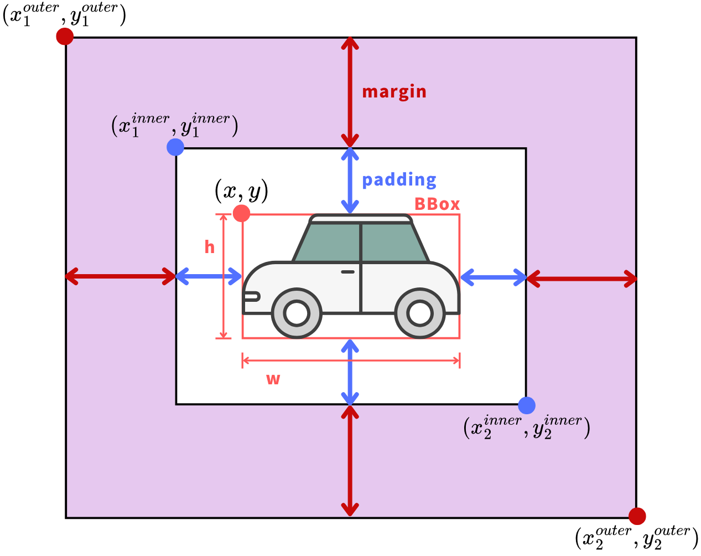

# UAV-MOT with Camera Motion Compensation using Optical Flow

This project is a Multi-Object Tracking (MOT) method for UAV-captured videos, designed to handle the challenges posed by camera movement. It is based on the [FairMOT](https://github.com/ifzhang/FairMOT) model, with an added position correction algorithm using Optical Flow.

## 1. Overview

Traditional Multi-Object Tracking (MOT) methods perform well on videos from static cameras. However, in videos captured by Unmanned Aerial Vehicles (UAV), the camera moves freely in 3D space. This causes significant changes in object appearance and complicates their motion paths, leading to a notable decline in tracking performance for conventional MOT methods.

This project addresses this issue by proposing a position correction algorithm that uses Optical Flow.
The key idea is to:

1. Estimate the camera's motion by calculating the Optical Flow of the background.
2. Correct the detected positions of objects based on this estimated camera motion.
3. Simplify the complex movements of objects, enabling more stable and accurate tracking.

By integrating this algorithm into the FairMOT baseline, we successfully reduced ID Switches and Fragmentations, demonstrating the effectiveness of the proposed approach on the [VisDrone2019](https://github.com/VisDrone/VisDrone-Dataset) and [UAVDT](https://arxiv.org/abs/1804.00438) datasets.

## 2. Baseline Model
This work is built upon the excellent research of **FairMOT**. We use it as our baseline for both object detection and tracking. For details on the original model, please refer to their paper and repository.

* **Paper:** [FairMOT: On the Fairness of Detection and Re-Identification in Multiple Object Tracking](https://arxiv.org/abs/2004.01888) 
* **Official GitHub:** [https://github.com/ifzhang/FairMOT](https://github.com/ifzhang/FairMOT)

## 3. Proposed Method: Position Correction with Optical Flow
The core of our contribution is to mitigate the instability of Kalman Filter-based position prediction in UAV videos. The instability is mainly caused by the camera's own ego-motion being added to the object's motion.

Our algorithm works as follows:
1. **Calculate Optical Flow**: For two consecutive frames, dense Optical Flow is calculated using the Gunnar Farnebäck method.

2. **Extract Background Motion**: For each detected object, we define a "neighborhood region" around its bounding box (BBox). By extracting the average Optical Flow from this region (while masking out other detected objects), we can estimate the camera's motion affecting that specific area.

3. **Correct Object Position**: The detected BBox position is then adjusted by subtracting the estimated background motion. This correction aligns the object's position to where it would be if the camera were static, making it easier for the tracking algorithm (Kalman Filter) to associate it across frames.

## 4. Experimental Rsults
We evaluated our method on two public UAV-based MOT datasets: **VisDrone2019** and **UAVDT**.

### Quantitative Results

Compared to the FairMOT baseline, our method showed a consistent reduction in ID Switches (IDs) and Fragmentations (FM), which are critical metrics for tracking continuity.

**Experiment A: VisDrone2019 - `pedestrian` class** 
| Method | IDs (↓) | FM (↓) | MOTA (↑) |
| :--- | :---: | :---: | :---: |
| FairMOT | 857 | 3201 | 31.48% |
| **Ours (FairMOT + OF)** | **760** | **3156**  | 27.05%  |

**Experiment B: VisDrone2019 - `car` class** 

| Method | IDs (↓) | FM (↓) | MOTA (↑) |
| :--- | :---: | :---: | :---: |
| FairMOT | 1449  | 2296  | 44.29%  |
| **Ours (FairMOT + OF)** | **893**  | **1973**  | 41.27%  |

**Experiment C: UAVDT - `car` class** 

| Method | IDs (↓) | FM (↓) | MOTA (↑) |
| :--- | :---: | :---: | :---: |
| FairMOT | 806  | 5522  | 35.36%  |
| **Ours (FairMOT + OF)** | **774**  | **5500**  | 34.85%  |

Note on MOTA: While our method improves tracking continuity (fewer IDs and FM), the MOTA score slightly decreased. This is likely because the position correction, while beneficial for association, can sometimes shift the BBox away from the ground truth, increasing False Positives (FP) and False Negatives (FN).

## 5. Setup and Usage
Coming Soon.

## 6. Acknowledgements
- This project is heavily based on FairMOT. We thank the authors for their great work.
- We thank the creators of the [VisDrone2019](https://github.com/VisDrone/VisDrone-Dataset)  and [UAVDT](https://arxiv.org/abs/1804.00438)  datasets for making their valuable data publicly available.
